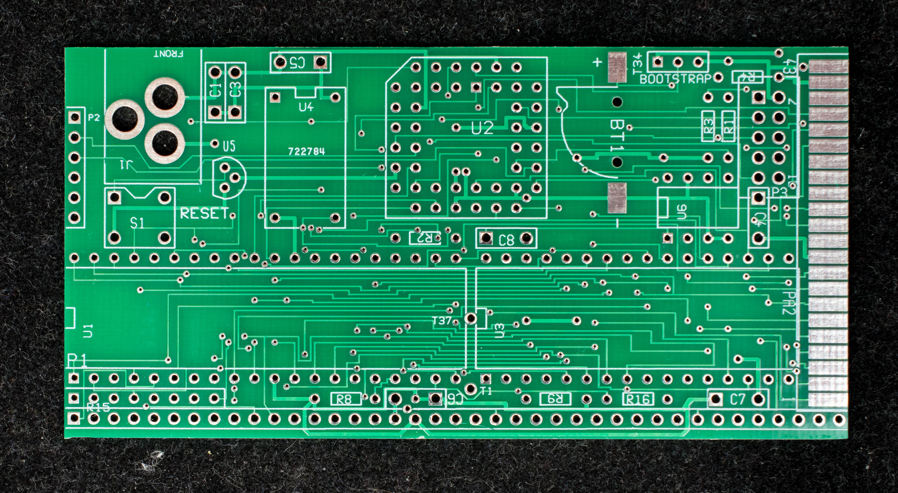
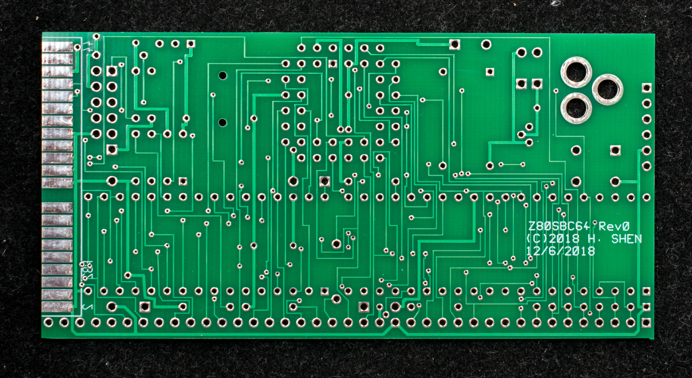
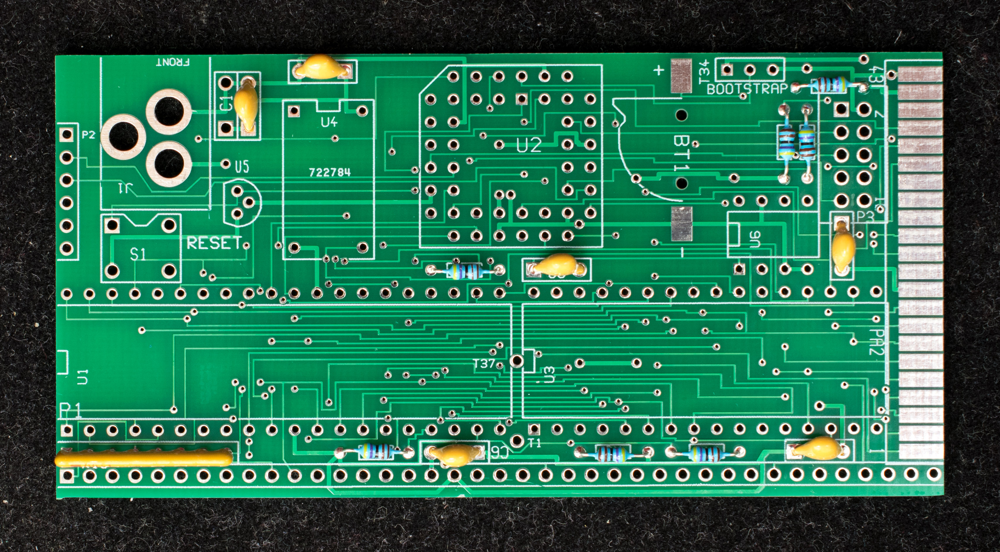
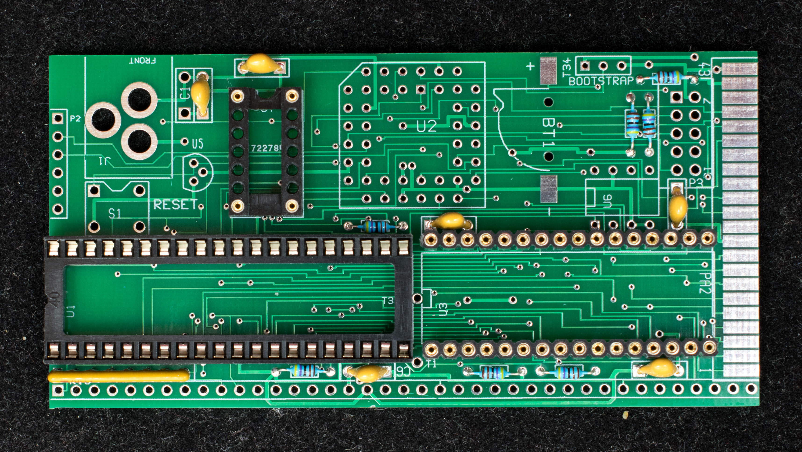
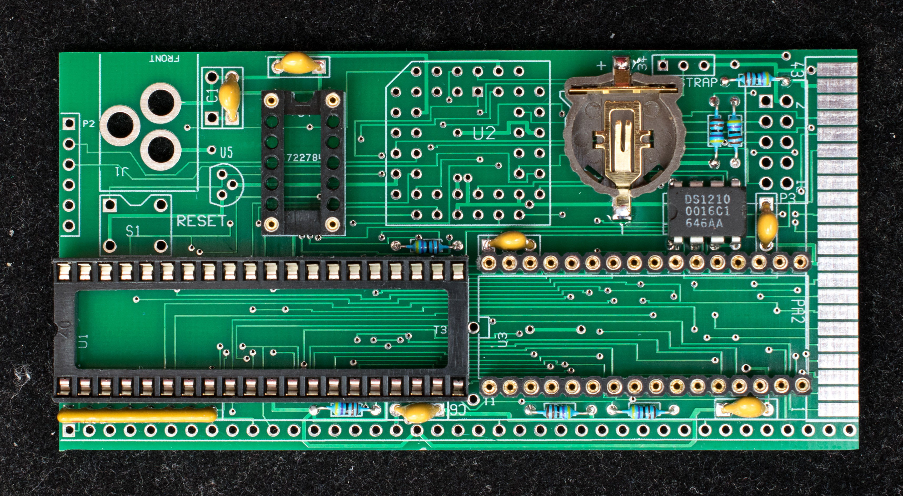
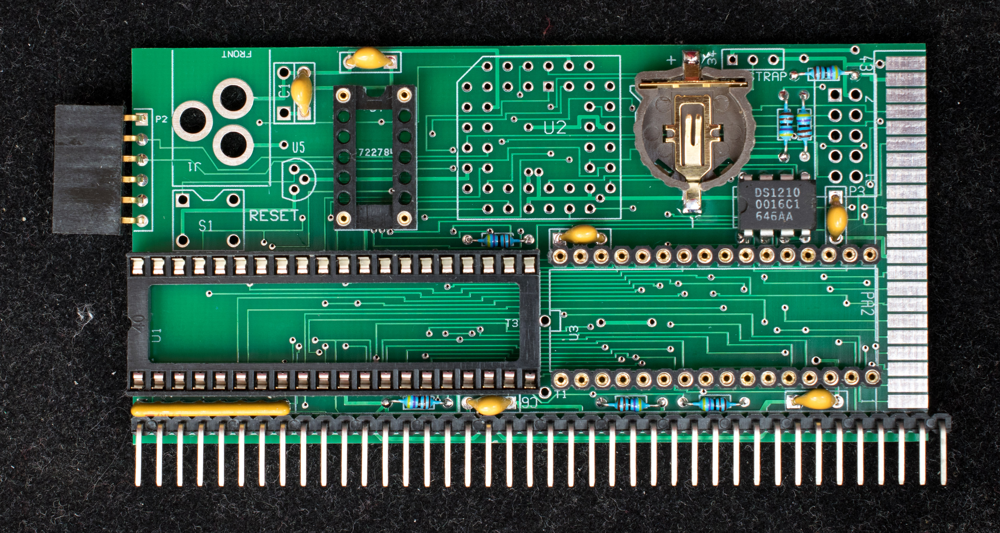
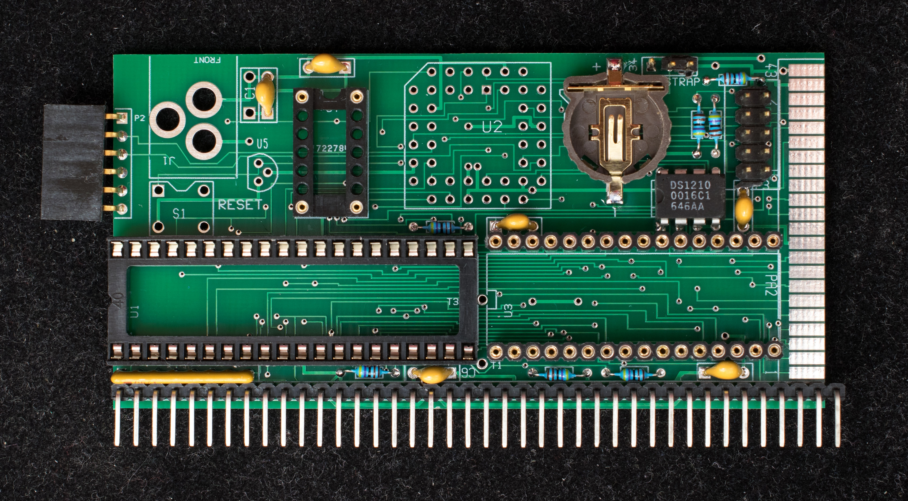
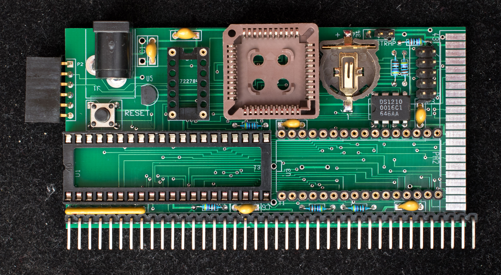
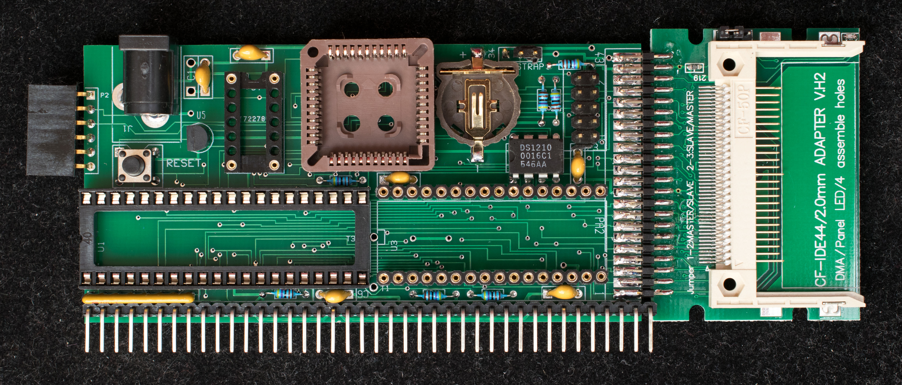

# Pictorial Assembly Guide for Z80SBC64
The sequence of soldering is start from the lowest height components to the tallest components. This keeps the components pressed against the pc board as the soldering progress.

**Bare PC board, component side**

**Bare PC board, solder side**

**Resistors, SIP resistor and bypass capacitors are soldered first**

**Next the IC sockets are soldered**

**DS1210 is soldered directly to the board because the clearance between pin 1 of DS1210 and the battery holder is too tight to allow a socket.**

**The serial port connector and RC2014 bus connector are soldered next.**

**The headers for Altera programming and Bootstrap mode are soldered next.**

**EPM7064 PLCC44 socket, power jack, push button, and voltage supervisor are soldered next**

**The 44-IDE adapter board is soldered last.**

The assembly is completed. The board should be cleaned with isopropyl alcohol and inspected before adding components. Altera EPM7064 should be inserted first and programmed before others are added.
