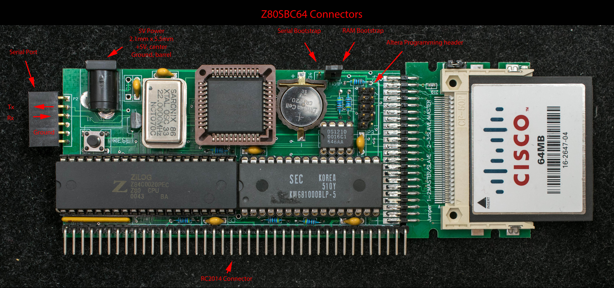
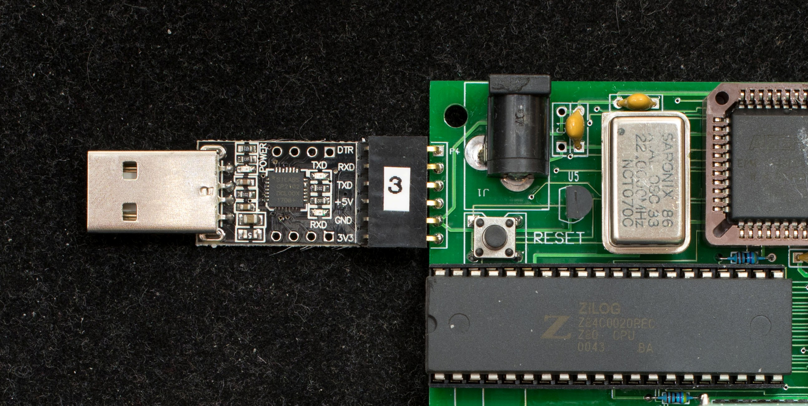

# Getting Started with a new Z80SBC64
### Introduction
The Getting Started guide is written for two audiences. One audience are buyers who have purchased the assembled/tested Z80SBC64 which is ready to be power up and use. The instruction for powering up the fully assembled/tested board is located at the end of this manual. The other audience are hobbyists who have downloaded the design information to build their own Z80SBC64 from scratch. Please read the entire guide if you are building Z80SBC64 from scratch.

Once a Z80SBC64 is assembled (see the pictorial assembly guide), the first component to populate is Altera EPM7064SLC44. Connect the USB Blaster cable to the 2×5 header such that the pin 1 (or red wire) is on the same side of silkscreen '2'. The programming file is “top.pof” in the [Z80SBC64_EPM7064.ZIP](../z80sbc64_epm7064.zip) design file.

Once the EPM7064S is programmed and verified, populate the rest of the components. If you have a CP2102 6-pin USB-serial adapter, it can plug directly in the 6-pin serial header. Only 3 signals are needed, transmit, receive and ground. Set the terminal program to 115200, no parity, 8 data bit, 1 stop bit, and no handshake. The bootstrap mode jumper should set to “serial bootstrap” which is on the side closest to the '+' terminal of the battery holder. Refer to connector picture for the bootstrap mode setting.





Apply +5V power to the board, remove the power and apply the power again. This recycling of power is required the very first time after a new battery is inserted to override the “battery saver” feature of DS1210. On the terminal program enable binary transfer and send [Z80SBCLD.BIN](../Software/z80sbcld.zip) The terminal program should display the sign-on message:
```
Z80SBC64 Loader v0.3
Auto start at 0xB400
```
This is Z80SBC64 correctly received and executing the 255 bootstrap code. It is ready for Intel Hex load file. Send the ZMon64.hex and be sure to uncheck the binary box if running TeraTerm. The bootstrap code will respond with a period ('.') for every Intel Hex record and finished with a 'X'. It will then start execution automatically and display this prompt:

*Z80SBC64 Monitor v{x.x} {date}*

Type 'c0' to copy ZMon64 to the bootstrap RAM area which is located in a different bank protected from modification by normal software. Power down the board and move the mode jumper to “RAM bootstrap” position. Reapply the power and you should see the ZMon64 sign-on message.

For TeraTerm users in Windows environment, the remaining software can be installed using a TeraTerm Macro here:

To install CP/M 2.2, load [cpm22all.hex](../Software/cpm22all_z80sbc64.zip) and type 'c2' to copy cpm22 CCP/BDOS/BIOS to track 0 of CF disk. Type “xA” to clear the directory of CF drive A:, “xB” to clear the directory of drive B:, etc. load XMODEM.HEX in ZMon64 and then type 'b2' to boot CP/M 2.2. At CP/M prompt, a>, type

**save 17 xmodem.com**

This will create a file “xmodem.com” in drive A: From now on, use xmodem to transfer files from PC to Z80SBC64. The command format is:

**xmodem filename /r/c/z1**

The first file to transfer is depkg.com and the 2nd file is cpm22dri.pkg. After both files are transferred, type

**depkg cpm22dri.pkg**

The CP/M 2.2 distribution files will be unpacked and copied into drive A: CP/M2.2 is ready to use now.

### Powering up an assembled/tested Z80SBC64
This section is for buyers of fully assembled/tested Z80SBC64. The board includes an USB-to-serial adapter and a 64meg compact flash with software already loaded.

1. Insert the USB-to-serial adapter as shown in the 2nd pictures above. The connector is new and maybe a tight fit so insert the adapter carefully and seat it fully.
2. Insert the CF disk in the CF adapter.
3. Connect a regulated 5V power supply with 2.1mm X 5.5mm power plug (center post is 5V, barrel is ground) to the power jack. Z80SBC64 without add-on boards consums about 200mA @ 5V. Jameco 1940571 is an inexpensive, quality power supply suitable for Z80SBC64 and future expansion boards.
4. Connect a USB extension cable between a desktop and the USB-serial adapter. Set the serial emulator such as TeraTerm to 115200, no parity, 8 data bits, 1 stop bit, and no handshakes.
5. Apply power. This sign on message should be displayed:
```
Z8SBC64 Monitor v{x.x} {date}

>
```
A 'h' command at the prompt will display a help menu. All commands are single character followed by a carriage return. A command can be canceled by any keyboard input that is NOT a carriage return. Z80SBC64 is already loaded with system software, so it is not necessary to use 'c' command to load any software. The 'b' command can be used to boot up SCMonitor ('b1' command), CP/M 2.2 ('b2' command), and CP/M 3 ('b3' command).


