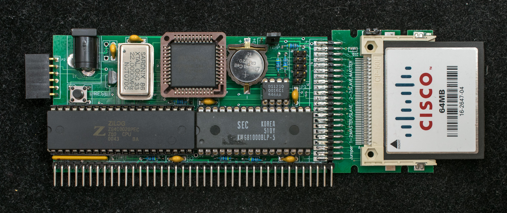
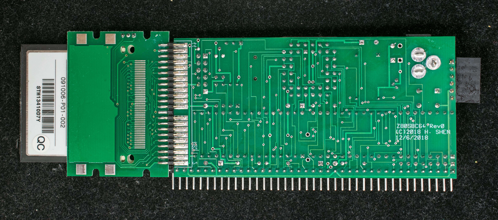

# Z80SBC64, Hobbyist Friendly Z80 SBC
Z80SBC64 is a hobbyist friendly version of Z80SBCRC. All components are either in through-hole technology or easy-to-solder surface mount components. The board is in the standard RC2014 (100mm x 50mm) form factor.

### Features
- Z80 running at 20MHz
- ROMless
- Battery-backed 128K RAM
- Altera EPM7064S in PLCC44 package
- 4 banks, each bank is 32KB
- Simple serial port with serial bootstrap capability
- Serial port operates at 115200 N81, no handshakes
- Compact flash interface
- CP/M 2.2 and CP/M 3
- 100mm x 50mm pc board
- RC2014 bus interface
### Functions
The heart of the SBC is a 5V CPLD, Altera EPM7064S, that implements the serial port receive function, generates baud clock, interfaces to compact flash, and divides memory into 4 banks of 32KB. The design has no ROM. The traditional ROM software are stored in battery-backed RAM. The serial bootstrap function loads the ROM-equivalent software into RAM when the board is powered up the first time; the system boots off the software in RAM for subsequent power cycles or resets. The ROM-equivalent software are protected by switching to banks inaccessible to normal software.

Instead of the EPM7128S, a smaller EPM7064S is used because it is available in PLCC44 package that can be socketed in a 44-pin PLCC through-hole socket. This is the design compromise to enable a hobbyist-friendly board with through-hole components and an easy-to-solder surface mount connector. Because of the limited resources on EPM7064S, the memory supported is 128KB with 4 banks of 32KB. Furthermore, the serial port transmit function is emulate in software (bit banging).

### Design information
- [Schematic](z80sbc64_scm.pdf)
- [Rev 1 Gerber photoplots](z80sbc64_r1_single.zip), minor corrections to rev 0. The pc boards were manufacturered by JLCPCB
- [Altera EPM7064SLC44 design file](z80sbc64_epm7064.zip). The design are created as schematic in Quartus 8.1.
  - [CPLD schematic](z80sbc64_cpld_scm.pdf) in PDF format
- [Memory and I/O map](Memory_Map.md)
- [Bill of Materials](bill_of_material_z80sbc64_r0.pdf)

### Software
- Z80SBCLD is the bootstrap loader. Configure Z80SBC64 to Serial Bootstrap mode and send Z80SBCLD.BIN as binary file to Z80SBC64 immediately after reset. Z80SBC64 will respond with “Z80SBC64 Loader v0.3” sign on message and ready to receive ZMon64 load file. Once ZMon64 is loaded, it will start program execution at 0xB400 which is the entry point of ZMon64.

- ZMon64 rev 0.7, improve the 'R' command, add 'c1' command to store SCMonitor in RAM and 'b1' command to execute the stored SCMonitor. Add 'c3' command to store CP/M 3 and 'b3' command to execute CP/M 3.

- SCMonitor is a sophisticated monitor developed by Steve Cousins. It has many features, among them a version of MS BASIC that runs well on Z80SBC64. After loading the hex file, type 'g0000' to start up SCMonitor.

- SCMonitor+StarTrek This version of SCMonitor already have the StarTrek program loaded in BASIC. Type 'WBASIC' in SCMonitor prompt and then 'RUN'.

- cpm22all is CP/M2.2 BDOS/CCP/BIOS for Z80SBC64. Use 'c2' command to store it in CF disk and use 'b2' command to boot into CP/M2.2. The software is assembled using Zilog ZDS v3.68.

- XMODEM is the file transfer program to bring in all CP/M programs from PC to Z80SBC64. While in monitor, send XMODEM.HEX as Intel Hex file, type 'b2' to boot into CP/M2.2, then type 'save 17 xmodem.com'. XMODEM.COM will be created as the first file on the CP/M disk. To invoke XMODEM to receive files, type 'xmodem filename /r/c/z1' and go to the terminal program to send file via xmodem.

- CPM22DRI is system files for CP/M2.2. Unzip the file to CPM22DRI.ARJ then use XMODEM to transfer it to CP/M. Once transferred, use unarj.com to decompress the files. CPM22DRI image is created using cpmtools.

- CPM3LDR is CP/M 3 loader program. Upload CPM3LDR.hex and type 'c3' to install it in the reserved sectors in CF drive. type 'b3' to boot CP/M 3

- CPM3 BIOS for Z80MB64 and Z80SBC64. They are assembled with ZMAC.

- CPM3ALL is CP/M 3 distribution files. Unzip to CPM3ALL.ARJ, then xmodem to Z80SBC64 and use unarj.com to decompress into drive A:

- unarj.com is the CP/M program that decompresses CPM3ALL.ARJ and CPM22DRI.ARJ above. The command is “unarj e filename”

### Instruction and Manuals
- Getting started guide

- ZMon64 manual

- Pictorial assembly guide

- Build Z80SBC64 in four stages, building a high-performance, CP/M capable Z80 SBC in four stages

- Creating new CF disk for Z80SBC64 and Z80MB64 with a TeraTerm Macro

